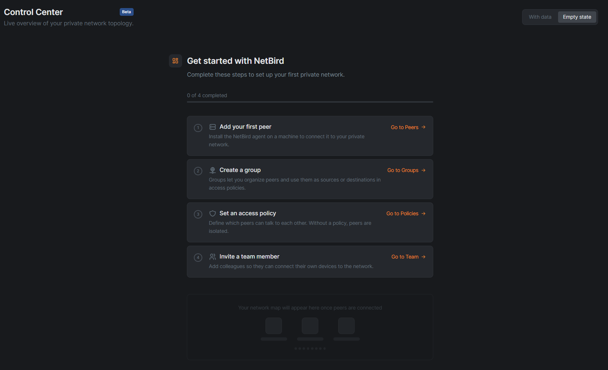
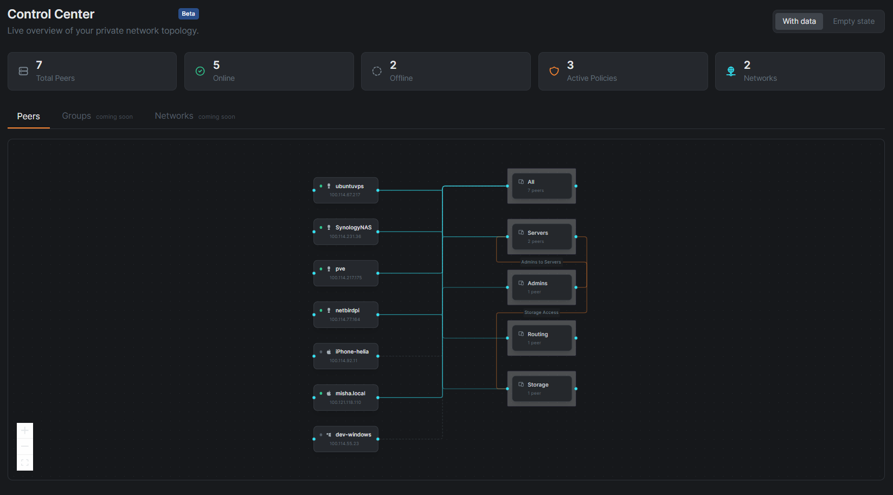
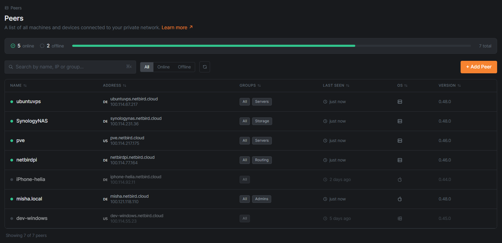
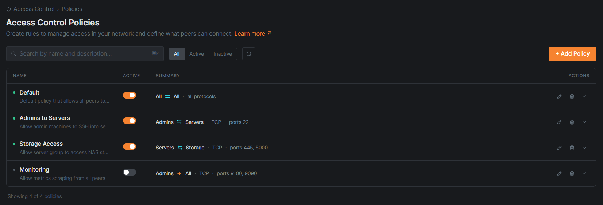
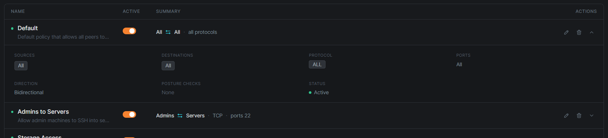
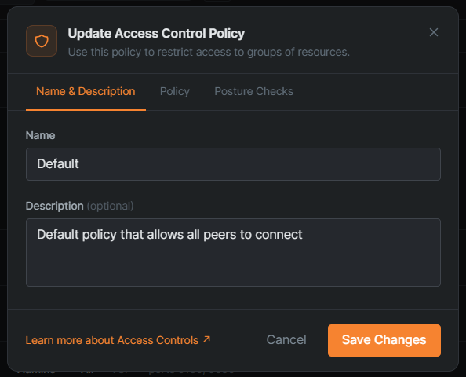
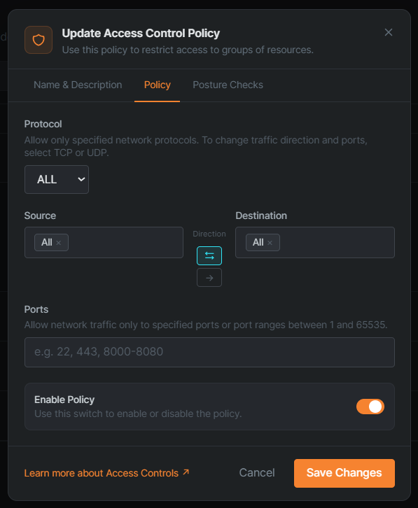
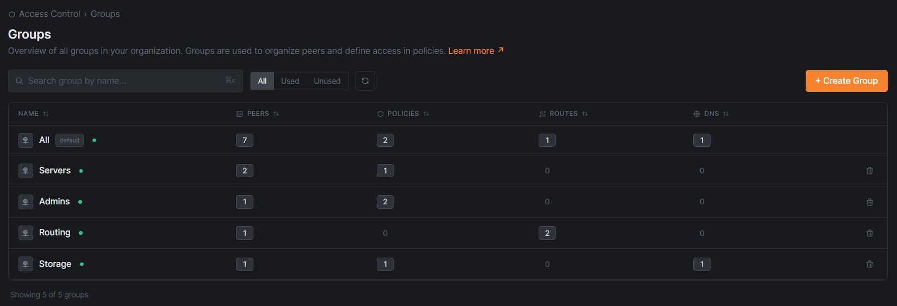

# NetBird Dashboard - UX Improvement Concept

An independent redesign concept for [NetBird](https://netbird.io), an open-source Zero Trust network access platform built on WireGuard®.

This project rebuilds four core sections of the [NetBird dashboard](https://app.netbird.io), Control Center, Peers, Access Control Policies, and Groups, focusing on real UX problems identified through careful study of their public platform, documentation, and open-source dashboard repository.

Built with the same stack as the original: **React + TypeScript + Tailwind CSS + Radix UI + @xyflow/react**.

> **Disclaimer:** This is an independent concept built for portfolio purposes, based on the publicly available NetBird platform and open-source repository. It is not affiliated with or endorsed by NetBird.

---

## Pages included in this demo

| Page                      | Status                     |
| ------------------------- | -------------------------- |
| Control Center            | ✅ Rebuilt                 |
| Peers                     | ✅ Rebuilt                 |
| Access Control - Policies | ✅ Rebuilt                 |
| Access Control - Groups   | ✅ Rebuilt                 |
| All other pages           | Intentionally out of scope |

---

## What was improved and why

### 1. Control Center - Empty State

**Problem:** The Control Center is the first item in the nav and is marked Beta. When a new user lands here after skipping onboarding, they see the same generic empty state repeated across every page in the product, an icon, one sentence, and a button. There is no sense of sequence, no explanation of what to build first, and no preview of what the end state looks like. The onboarding flow collects user preferences (Business vs Personal, use case) but the dashboard ignores them entirely after signup.

**Solution:** A structured getting-started checklist replaces the dead-end empty state. Four steps in the correct order: Add Peer → Create Group → Set Access Policy → Invite Team Member. Each with a numbered completion indicator, a one-line explanation of why it matters, and a direct navigation link. A progress bar tracks completion across steps. Below the checklist, a ghost network map preview shows the shape of what the user is building toward, answering the implicit question "what am I building here?"



---

### 2. Control Center - Populated State

**Problem:** The populated Control Center exists in the product as a Beta React Flow canvas with no surrounding context. There are no health metrics, no summary numbers, and the Groups and Networks tabs are present but completely empty with no indication of whether they are planned, broken, or intentionally blank.

**Solution:** A summary bar with five stat cards (Total Peers, Online, Offline, Active Policies, Networks) sits above the network map, answering "is everything okay?" in under three seconds. The network map shows peer nodes connected to group nodes with animated edges for online peers, dashed edges for offline peers, and orange edges between groups representing active policies. The Groups and Networks tabs are visibly present but marked "coming soon", intentional scoping, not abandoned work. A toggle between empty and populated states is included specifically for demo purposes.



---

### 3. Peers - Network Health Summary

**Problem:** The original Peers page goes straight into a table with no health context. There is no at-a-glance indicator of how many peers are online versus offline. You have to count rows yourself.

**Solution:** A health bar sits above the table showing online count, offline count, a proportional green progress bar, and total peers, all derived from live data. Offline peers are visually dimmed at the row level so they recede without disappearing entirely.

**Problem:** The OS column exists in the original but uses a generic NetBird icon for every peer regardless of operating system. A Linux server, a macOS laptop, and an iPhone look identical.

**Solution:** Each row shows its correct OS icon, Linux, Apple, Windows, Android, making the column actually informative. Country flags add geographic context without requiring a dedicated column.



---

### 4. Access Control Policies - Expandable Rows

**Problem:** The original policies table has eight columns visible simultaneously, Name, Active, Sources, Direction, Destinations, Protocol, Ports, Posture Checks, all at equal visual weight. The Direction column uses an unlabeled green arrow graphic. Descriptions are truncated with no expand affordance. The table is wide, dense, and hard to scan.

**Solution:** Each policy collapses to its essential information: name, active status, and summary ("Admins ↔ Servers · TCP · ports 22"). Clicking any row expands it to show the full detail in a clean grid. The direction arrow is now a labeled control, bidirectional (↔) or unidirectional (→) visible in both collapsed and expanded states.





---

### 5. Access Control Policies - Fixed Modal Tab Order

**Problem:** The policy creation modal has three tabs in this order: Policy → Posture Checks → Name & Description. The user configures protocol, sources, destinations, and ports before they can name the policy. The tab order is the inverse of how people think.

**Solution:** Tab order is corrected to Name & Description → Policy → Posture Checks. Name and describe first, then configure. The direction control in the Policy tab is replaced with two explicitly labeled buttons with visible active states, replacing the original's unlabeled arrow graphic.





---

### 6. Access Control Groups - Labeled Column Headers

**Problem:** The original Groups table uses icon-only column headers after the Name column. Seven columns with no text labels. Users must hover each one to understand what it represents. This is inconsistent with every other table in the product, which uses text headers, and fails basic scannability.

**Solution:** Every column has a text label, PEERS, POLICIES, ROUTES, DNS, with its icon alongside as a visual aid rather than a replacement for text. Count badges are visually active only when the value is greater than zero, so empty columns recede and non-zero values stand out immediately.



---

### 7. Navigation consistency

**Problem:** The breadcrumb pattern is applied inconsistently across the product. The Posture Checks page has a breadcrumb ("Access Control › Posture Checks"), while Policies and Groups do not, despite being siblings in the same section.

**Solution:** A consistent breadcrumb is applied to all pages in this demo, giving every page the same structure: breadcrumb → title → description with documentation link.

---

## What was deliberately left out of scope

- **Setup Keys:** the populated state has UX potential but the empty state pattern is the same systemic issue already addressed in Control Center
- **Network Routes:** NetBird is actively deprecating this in favor of Networks; improving a legacy page would work against their product direction
- **DNS Settings:** sparse page with a single negative-framing option; worth improving but lower impact than the pages included
- **Onboarding flow:** the flow exists and collects user context (Business vs Personal, use case) but the dashboard ignores it. A proper fix requires the dashboard to personalize based on onboarding answers, which goes beyond a UI rebuild

---

## Tech stack

| Tool                  | Reason                                          |
| --------------------- | ----------------------------------------------- |
| React 18 + TypeScript | Matches NetBird's actual dashboard stack        |
| Vite                  | Fast dev server, simple GitHub Pages deployment |
| Tailwind CSS          | Matches NetBird's actual dashboard stack        |
| Radix UI primitives   | Matches NetBird's actual component foundation   |
| @xyflow/react         | Same library used in NetBird's Control Center   |
| @tabler/icons-react   | Same icon library used in NetBird's dashboard   |
| Sonner                | Toast notifications matching product behavior   |
| React Router          | Client-side routing between demo pages          |

Design tokens (colors, spacing, typography) are extracted directly from NetBird's open-source [`dashboard` repository](https://github.com/netbirdio/dashboard), specifically `tailwind.config.ts`.

---

## Project structure

```
src/
├── components/
│   ├── ui/                        # Reusable primitives (Button)
│   ├── layout/                    # Sidebar, TopBar, AppLayout, ProfileDropdown
│   ├── control-center/            # NetworkMap, SummaryBar, GettingStartedChecklist
│   ├── peers/                     # PeersTable, PeerRow, PeersHealthBar
│   └── access-control/            # PoliciesTable, PolicyRow, PolicyEditModal, GroupsTable
├── data/
│   └── mockData.ts                # Peers, groups, policies, networks
├── pages/                         # One file per route
├── lib/
│   └── utils.ts                   # cn() helper
└── styles/
    └── globals.css                # Tailwind directives and CSS custom properties
```

---

## Running locally

```bash
npm install
npm run dev
```

Open `http://localhost:5173` in your browser.

The demo uses realistic mock data matching the peer names, group structures, and policy patterns visible in NetBird's public documentation and YouTube demos. The Control Center includes a toggle to switch between empty and populated states without navigating away.

---

## Context

The goal was to go beyond a standard portfolio piece by working directly with a real product, identifying genuine UX problems, and proposing solutions grounded in how the platform is actually used.

The research process included creating a NetBird account and exploring the full dashboard, studying their open-source [`dashboard` repository](https://github.com/netbirdio/dashboard) to understand their exact tech stack and design tokens, watching their product demos, and reading their documentation to understand the domain (peers, groups, policies, networks) before writing any code.

All improvements prioritise the needs of the people actively managing the network, understanding health at a glance, configuring access policies without friction, and onboarding new peers and team members efficiently.
